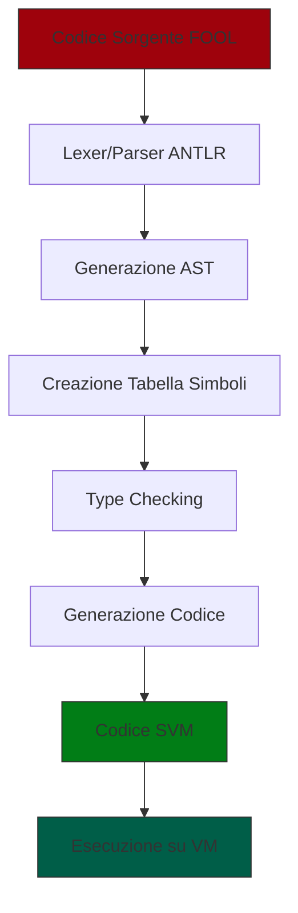

# Documentazione del Compilatore FOOL
FOOL (Functional Object-Oriented Language) è un linguaggio di programmazione che combina caratteristiche funzionali e orientate agli oggetti. Questo documento descrive l'architettura e il funzionamento del suo compilatore.
## Architettura del pattern Visitor
Il compilatore è costruito attorno al pattern Visitor, ovvero un design pattern comportamentale che permette di separare gli algoritmi dalla struttura dati su cui operano. Nel nostro caso diversi visitor attraversano l'Abstract Syntax Tree per eseguire diverse fasi della compilazione.
### Vantaggi del Pattern Visitor
- **Serarazione delle responsabilità**: Ogni visitor si occupa di una specifica fase della compilazione
- **Estensibilità**: possono essere aggiunte nuove operazioni implementando nuovi visitor
- **Type Safety**
## Flusso di compilazione

### 1. Analisi Lessicale e Sintattica (Lexing e Parsing)
Nel file ```FOOL.g4``` sono presenti la grammatica (lexer) e le regole di parsing. 
- Il lexer suddivide il codice sorgente in token, i quali rappresentano le unità base del linguaggio come ad esempio identificatori, numeri, operatori e parole chiave.
- Il parser costruisce un albero di parsing che rappresenta la struttura sintattica del programma. Questo processo verifica che il programma sia sintatticamente corretto secondo le regole definite nella grammatica FOOL.
### 2. Generazione dell'AST
```ASTGenerationSTVisito.java``` si occupa di trasformare l'albero sintattico precedentemente costruito in un Abstract Syntax Tree, ovvero una rappresentazione più astratta e gerarchica del programma che elimina i dettagli sintattici non necessari per le fasi successive.

## Struttura del progetto
La dir src si divide in:
- compiler
- stack virtual machine
### Compiler
Al suo interno sono presenti
- ```FOOL.g4```: è la grammatica ANTLR4 che definisce la sintassi del linguaggio FOOL.
- ```AST.java```: definisce la struttura dell'Abstract Syntax Tree (AST), ovvero la rappresentazione gererchica del programma dopo il parsing.
- ```ASTGenerationSTVisito.java```: Questo visitor si occupa di generare l'AST a partire dall'albero di parsing creato da ANTLR.
- ```SymbolTableASTVisitor.java```: gestisce la creazione e il popolamento della tabella dei simboli.
- ```TypeCheckASTVisitor.java```: implementa il controllo dei tipi, verificando che tutte le operazioni siano type-safe.
- ```CodeGenerationASTVisitor.java```: genera il codice a partire dall'AST.
- ```/exc```: dir dove sono presenti le classi che gestiscono le varie Exceptions che possono verificarsi durante la compilazione.
### SVM
Macchina virtuale basata su stack che esegue il bytecode generato dal compilatore.

- ```SVM.g4```: definisce le regole di parsing e i token della SVM utilizzando ANTLR. La sintassi, ovvvero le regole di parsing, convertono il codice assembly della SVM in bytecode. Ad esempio l'istuzione: ```PUSH n=INTEGER { code[i++] = PUSH; code[i++] = Integer.parseInt($n.text); }``` traduce ```push 10   →   [PUSH, 10] (bytecode)}```
- ```ExecuteVM.java```: esegue il bytecode generato dal parsing effettuato in SVM.g4. Il ciclo della CPU (fetch-decode-execute) legge un'istruzione, la interpreta e aggiorna lo stack, la memoria o il controllo di flusso.
## Flusso di funzionamento

Il processo di compilazione del linguaggio fool segue i seguenti passi:
